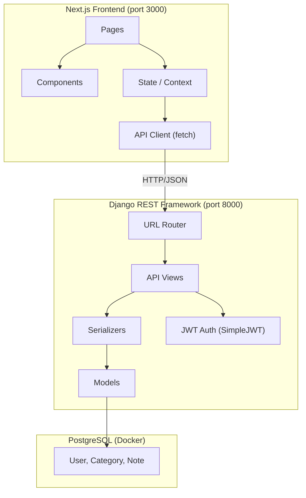
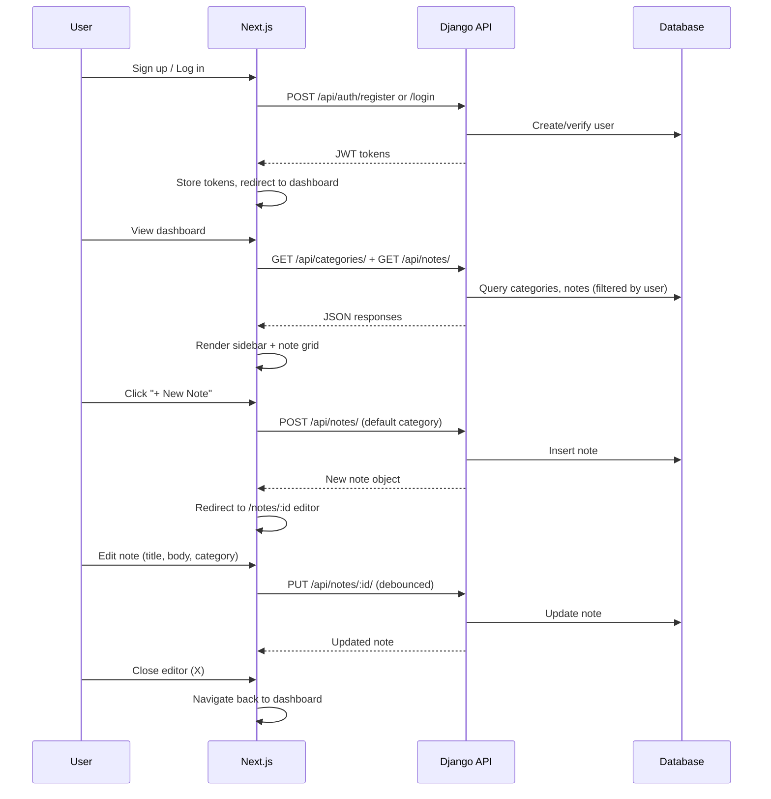

# Note-Taking App

**Status:** TASK_REVIEW
**Branch:** feature/note-taking-app
**Date:** 2026-03-29

---

## Requirements

### 1. Authentication
- **Sign Up**: email + password registration. Friendly heading "Yay, New Friend!" with a cow/cat illustration.
- **Login**: email + password login. Friendly heading "Yay, You're Back!" with a cactus illustration.
- Link to toggle between Sign Up ↔ Login ("We're already friends!" / "Oops! I've never been here before").
- Warm cream/beige background (`~#FFF5E6`).
- JWT-based authentication.

### 2. Dashboard (Home)
- **Left sidebar**: "All Categories" header, list of categories with colored dot indicator and note count.
- **Main area (notes grid)**: Responsive grid of note cards.
- **Empty state**: Bubble tea illustration with the message "I'm just here waiting for your charming notes..."
- **"+ New Note" button**: top-right corner, creates a new note.
- Each note card shows:
  - Date (relative: "today", "yesterday", or formatted date)
  - Category name
  - Note title (bold)
  - Content preview (truncated)
  - Background color matching the note's category

### 3. Note Editor (Full-Page)
- Occupies the full viewport.
- **Category dropdown** (top-left): shows current category with colored dot; dropdown lists all categories.
- **Close button** (X, top-right): returns to dashboard.
- **"Last Edited" timestamp** (top area, right-aligned): e.g. "Last Edited: July 31, 2024 at 8:30pm".
- **Title field**: large bold text, placeholder "Note Title".
- **Body field**: free-text area, placeholder "Pour your heart out..."
- **Background color** changes based on selected category.
- Auto-save behavior (save on close or debounced auto-save).

### 4. Categories
Pre-defined categories, each with a unique color:
| Category         | Dot / Card Color   |
|------------------|--------------------|
| Random Thoughts  | Orange / Peach     |
| School           | Yellow / Light Gold|
| Personal         | Sage / Olive Green |
| Drama            | Light Pink / Tan   |

Users select a category per note via a dropdown.

### 5. Visual Design
- Warm, friendly aesthetic with cream/beige backgrounds.
- Soft pastel card colors per category.
- Cute illustrations on auth pages and empty state.
- Rounded UI elements (buttons, cards, dropdowns).
- Font style: serif-like or warm sans-serif for headings.

---

## Acceptance Criteria

1. **Auth**: User can sign up, log in, and log out. Invalid credentials show error. Authenticated routes are protected.
2. **Dashboard**: After login, user sees their notes in a grid. Sidebar shows categories with accurate counts. Clicking a category filters notes. Empty state shows when no notes exist.
3. **Create Note**: Clicking "+ New Note" opens the full-page editor with default category. User can type title and body, select a category, and close to save.
4. **Edit Note**: Clicking a note card opens the editor pre-filled. Changes persist.
5. **Delete Note**: User can delete a note (from the editor or dashboard).
6. **Category Colors**: Note cards and editor backgrounds reflect the assigned category color.
7. **Responsive**: Works on MacBook Air-sized screens (≥1280px).
8. **Timestamps**: Notes show "Last Edited" datetime in the editor, and relative dates on cards.

---

## Design

### Architecture Overview



### Backend (Django REST Framework)

**Project structure:**
```
backend/
├── manage.py
├── requirements.txt
├── config/              # Django project settings
│   ├── settings.py
│   ├── urls.py
│   └── wsgi.py
├── accounts/            # User auth app
│   ├── models.py        # (uses default User)
│   ├── serializers.py   # RegisterSerializer, LoginSerializer
│   ├── views.py         # RegisterView, LoginView
│   └── urls.py
└── notes/               # Notes + Categories app
    ├── models.py         # Category, Note
    ├── serializers.py    # CategorySerializer, NoteSerializer
    ├── views.py          # CategoryViewSet, NoteViewSet
    └── urls.py
```

**Models:**
- `Category`: id, name, color (hex string), created_at
- `Note`: id, user (FK→User), category (FK→Category), title, body, created_at, updated_at

**API Endpoints:**
| Method | Endpoint               | Description                    |
|--------|------------------------|--------------------------------|
| POST   | /api/auth/register/    | Create account                 |
| POST   | /api/auth/login/       | Get JWT tokens                 |
| POST   | /api/auth/refresh/     | Refresh JWT token              |
| GET    | /api/categories/       | List categories (with counts)  |
| GET    | /api/notes/            | List user's notes              |
| POST   | /api/notes/            | Create note                    |
| GET    | /api/notes/:id/        | Get single note                |
| PUT    | /api/notes/:id/        | Update note                    |
| DELETE | /api/notes/:id/        | Delete note                    |

**Auth:** `djangorestframework-simplejwt` for access + refresh tokens. Notes are scoped to the authenticated user.

**Seeded data:** Categories are seeded via a migration: Random Thoughts (orange), School (yellow), Personal (sage green), Drama (tan/pink).

### Frontend (Next.js + React)

**Project structure:**
```
frontend/
├── package.json
├── next.config.js
├── tailwind.config.js
├── tsconfig.json
├── public/
│   └── illustrations/    # SVG illustrations (cow, cactus, bubble tea)
├── src/
│   ├── app/
│   │   ├── layout.tsx
│   │   ├── page.tsx           # Redirect → /login or /dashboard
│   │   ├── login/page.tsx
│   │   ├── signup/page.tsx
│   │   ├── dashboard/page.tsx
│   │   └── notes/
│   │       └── [id]/page.tsx  # Note editor
│   ├── components/
│   │   ├── NoteCard.tsx
│   │   ├── CategorySidebar.tsx
│   │   ├── CategoryDropdown.tsx
│   │   ├── NoteEditor.tsx
│   │   ├── EmptyState.tsx
│   │   └── AuthForm.tsx
│   ├── lib/
│   │   ├── api.ts            # API client with JWT handling
│   │   ├── auth.tsx          # AuthContext provider
│   │   └── types.ts          # TypeScript interfaces
│   └── styles/
│       └── globals.css
```

**Tech choices:**
- **Next.js 14+ (App Router)** with TypeScript
- **Tailwind CSS** for styling
- **Context API** for auth state (lightweight, no Redux needed)
- Client-side data fetching with `fetch` (notes are user-specific, no SSR benefit)

**Key components:**
- `AuthForm`: Shared form for login/signup with illustration, heading, fields, and toggle link.
- `CategorySidebar`: Shows "All Categories" with colored dots and note counts. Clicking filters notes.
- `NoteCard`: Displays date, category, title, preview. Background color from category.
- `NoteEditor`: Full-page editor with category dropdown, title, body, timestamp, and colored background.
- `CategoryDropdown`: Dropdown selector showing categories with colored dots.
- `EmptyState`: Illustration + message when no notes exist.

**Category color mapping (Tailwind):**
| Category        | Card BG       | Dot Color     |
|-----------------|---------------|---------------|
| Random Thoughts | bg-[#F5D6C3]  | bg-[#E07C4F]  |
| School          | bg-[#E8DDB5]  | bg-[#C4B44E]  |
| Personal        | bg-[#C8D5B9]  | bg-[#7A9B5E]  |
| Drama           | bg-[#F0DCC8]  | bg-[#D4A574]  |

### Data Flow



### Key Decisions

1. **JWT over sessions**: Decoupled frontend/backend; tokens stored in localStorage with refresh rotation.
2. **PostgreSQL via Docker**: All services containerized with Docker Compose (PostgreSQL, Django, Next.js).
3. **Pre-seeded categories**: Categories are not user-created; they're global and seeded via migration.
4. **Auto-save with debounce**: The editor saves automatically 1s after the user stops typing. No explicit "Save" button (matches the design).
5. **Client-side filtering**: Category filtering on the dashboard happens client-side (small dataset).

---

## Tasks

### Wave A — Project Scaffolding (parallel, no dependencies)

- [ ] **A0: Docker Compose + infrastructure**
  - `docker-compose.yml` with 3 services: `db` (PostgreSQL 16), `backend` (Django), `frontend` (Next.js)
  - `backend/Dockerfile` — Python 3.12, install requirements, run with gunicorn/dev server
  - `frontend/Dockerfile` — Node 20, install deps, run dev server
  - `.env` file with DB credentials, Django secret key, etc.
  - `.gitignore` for both Python and Node artifacts, `.env`, certs/keys

- [ ] **A1: Scaffold Django backend**
  - Create `backend/` with Django project (`config/`), `accounts` app, `notes` app
  - `requirements.txt` with Django, DRF, simplejwt, django-cors-headers, psycopg2-binary
  - `config/settings.py` configured: installed apps, REST framework, JWT, CORS, PostgreSQL database from env vars
  - `config/urls.py` wiring

- [ ] **A2: Scaffold Next.js frontend**
  - Create `frontend/` with Next.js 14+ App Router, TypeScript, Tailwind CSS
  - Directory structure: `src/app/`, `src/components/`, `src/lib/`
  - Tailwind config with the warm color palette from designs
  - Global styles (cream background, font choices)
  - `src/lib/types.ts` with TypeScript interfaces (User, Category, Note)

### Wave B — Backend Core (sequential within wave, depends on A1)

- [ ] **B1: Models + Migrations**
  - `notes/models.py`: Category (name, color), Note (user FK, category FK, title, body, timestamps)
  - Data migration to seed 4 categories with colors
  - Run `makemigrations` + `migrate`

- [ ] **B2: Auth API**
  - `accounts/serializers.py`: RegisterSerializer, LoginSerializer (email + password)
  - `accounts/views.py`: RegisterView (POST), login via simplejwt TokenObtainPairView
  - `accounts/urls.py` + wire into `config/urls.py`
  - Depends on: B1 (user model ready)

- [ ] **B3: Notes + Categories API**
  - `notes/serializers.py`: CategorySerializer (with note count annotation), NoteSerializer
  - `notes/views.py`: CategoryViewSet (list only), NoteViewSet (full CRUD, filtered by user)
  - `notes/urls.py` with DRF router + wire into `config/urls.py`
  - Depends on: B1

### Wave C — Frontend Pages (parallel within wave, depends on A2)

- [ ] **C1: Auth pages (Login + Signup)**
  - `src/lib/api.ts`: API client with base URL, JWT token handling (store/retrieve/refresh)
  - `src/lib/auth.tsx`: AuthContext + AuthProvider (login, signup, logout, user state)
  - `src/components/AuthForm.tsx`: Shared form component with illustration, heading, fields, button, toggle link
  - `src/app/login/page.tsx` + `src/app/signup/page.tsx`
  - `src/app/layout.tsx`: Wrap with AuthProvider
  - SVG illustrations in `public/illustrations/`

- [ ] **C2: Dashboard page**
  - `src/components/CategorySidebar.tsx`: "All Categories" header, category list with dots + counts, click to filter
  - `src/components/NoteCard.tsx`: Date, category label, title, content preview, category-colored background
  - `src/components/EmptyState.tsx`: Bubble tea illustration + message
  - `src/app/dashboard/page.tsx`: Protected route, fetch categories + notes, render sidebar + grid
  - SVG illustration for empty state

- [ ] **C3: Note editor page**
  - `src/components/CategoryDropdown.tsx`: Dropdown with colored dots for each category
  - `src/components/NoteEditor.tsx`: Full-page editor — category dropdown, close X, timestamp, title, body, colored background
  - `src/app/notes/[id]/page.tsx`: Protected route, fetch note, auto-save with debounce on changes
  - `src/app/notes/new/page.tsx` or create-then-redirect flow from dashboard

### Wave D — Integration + Polish (depends on B2, B3, C1, C2, C3)

- [ ] **D1: End-to-end wiring + route protection**
  - Ensure API client sends JWT on all requests
  - Protected route middleware/wrapper redirecting to /login if unauthenticated
  - Root page (`/`) redirects to `/dashboard` or `/login`
  - CORS configured between frontend ↔ backend containers
  - Verify full `docker compose up` brings up all 3 services and DB migrations run on startup

- [ ] **D2: Polish + visual fidelity**
  - Match category colors precisely to designs
  - Relative date formatting ("today", "yesterday", "June 12")
  - Truncated note preview on cards
  - Responsive grid layout
  - Hover/focus states on interactive elements
  - Loading states and error handling

### Dependency Graph

```
A0 (Docker) ─┬──→ A1 ──→ B1 ──→ B2
              │               ──→ B3
              │                         ╲
              └──→ A2 ──→ C1             ──→ D1 ──→ D2
                    ──→ C2              ╱
                    ──→ C3 ────────────╱
```

**Parallelization plan:**
- A0 runs first (Docker Compose, Dockerfiles, .env, .gitignore)
- A1 and A2 run in parallel after A0 (disjoint directories)
- B1 runs after A1; then B2 and B3 can run in parallel
- C1, C2, C3 run in parallel after A2 (disjoint files)
- D1 and D2 run sequentially after all B + C tasks complete

---

## Implementation Notes

*To be filled during Phase 4.*

---

## Review

*To be filled in Phase 5.*
